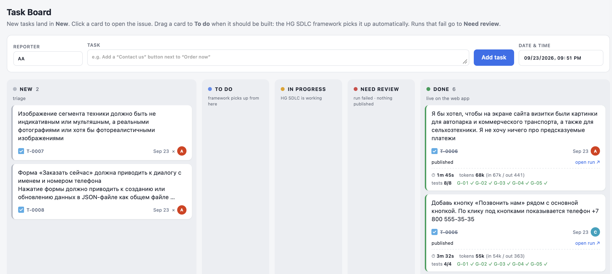
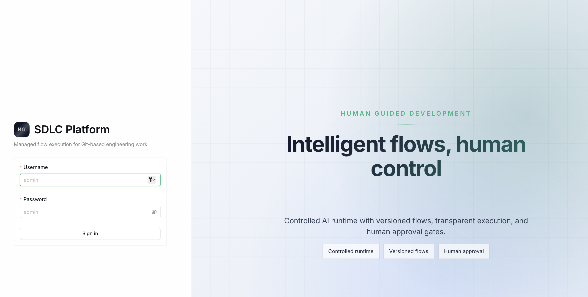
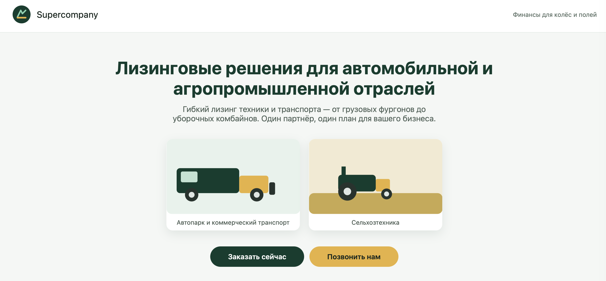

# HG SDLC demo: intent → code → live site

A 30-second walkthrough is in [screencast/hgsdlc_screencast.mp4](screencast/hgsdlc_screencast.mp4).

Three containers share one folder (`./shared`):

| Tab | URL | Container | What it is |
|---|---|---|---|
| 1 | http://localhost:8081 | `taskboard` | Simple kanban board (New / To do / In progress / Need review / Done). Each task has a reporter, the task text and a date/time. |
| 2 | http://localhost:8080 | `framework` | [Human Guided SDLC](https://gitverse.ru/kakvsbere/hgsdlc) (backend and UI) with the OpenCode CLI connected to OpenRouter. Log in as `admin` / `admin`. |
| 3 | http://localhost:8082 | `webapp` | The client-facing web app ("Supercompany") that the framework changes. |

```
task board ──(REST: launch run)──▶ HG SDLC ──(git push main)──▶ git://webapp/webapp.git ──▶ nginx serves it
     ▲                                  │
     └──────(polls run status)──────────┘
```

## Screenshots

**1. Task board** — intent goes in here. Each card is a task, tracked through New → To do → In progress → Need review → Done, with the run's duration, token usage and governance/test results once it's done.



**2. HG SDLC (the engine)** — picks up a task and runs it through the spec-driven flow.



**3. The web app** — the client-facing result. Every published task shows up here, live.



The repo comes pre-seeded with a finished demo run (see [screencast](screencast/hgsdlc_screencast.mp4)): 6 completed tasks on the board with their specs, tests and validation, and the web app already showing everything they built. A fresh clone looks exactly like the recording — no need to build anything first to see the point.

## Run

```bash
git clone --recurse-submodules https://github.com/icec0de/hgsdlc-demo.git && cd hgsdlc-demo
cp .env.example .env        # put your OpenRouter key in it
make start                  # build if needed, start, wait until ready, open the 3 tabs
make stop                   # stop the containers; containers and all data are kept
make restart                # stop + start; nothing is lost
make reset                  # asks for confirmation, then removes containers AND wipes all data
```

Other targets: `make open` (reopen the tabs), `make status`, `make logs`.

You need Docker running (OrbStack, Docker Desktop, Colima, …) and an [OpenRouter](https://openrouter.ai/) API key. `make start` fetches the framework submodule if it's missing, and tries to start OrbStack/Docker Desktop for you on macOS if neither is running. The first build takes about 5 minutes, because it compiles the framework from `./hgsdlc`.

## Demo script

1. **Tab 1:** add a task, for example *"Add a 'Contact us' button next to 'Order now'"* or *"Make the Order button green"*. It lands in **New**.
2. Drag the card to **To do**. Within about 3 seconds the framework picks it up and the card moves to **In progress**. Its **open run ↗** link opens that run in tab 2.
3. **Tab 2:** the Run Console shows the flow graph (prepare → specify → write-tests → implement → validate → merge-spec → record-increment), the live agent log, artifacts, the diff and the audit trail.
4. When the run finishes, the framework commits and pushes to `main`. **Tab 3** reloads itself with the change, and the card moves to **Done**.
5. If the run fails, nothing is published and the card goes to **Need review** with the error code. From there, drag it back to **To do** to retry, or to **Done** to accept it.

Every task gets a unique ID (`T-0001`, …), shown Jira-style on its card; clicking a card opens the issue view with its delta spec, validation and master snapshot, and `http://localhost:8081/#T-0005` links straight to it. Spec folders are named by the ID only. The flow is spec-driven: **specify → write tests → implement → validate → merge spec → record increment**. Each successful task leaves an increment, visible in Finder under `shared/specs/`:

```
shared/specs/governance.md                     principles every task is validated against (G-01: the page is always in Russian, …)
shared/specs/master.md                         current master spec + increments log
shared/specs/changes/T-0005/
  delta.md                                     what this task changes (written before coding)
  validation.md                                each principle: result + evidence, and every test run
  validation.json                              the same, machine-readable
  master.md                                    master spec right after this increment
```

The AI writes one Playwright test per scenario of the delta spec, in `tests/T-0005.spec.js` in the repo. The validation step runs in the framework image, so the AI can't change it. It runs every task's tests, as a regression suite, plus the governance tests, and it fails the run if any principle fails. Specs and tests are committed together with the code, but they aren't served on the public site.

Done cards show tests passed/total and a ✓/✗ per principle; hover for the evidence. Done and Need review cards show the run's duration and token usage (total, input including cached, and output), as reported by the framework.

Tasks run one at a time in the order they were created.

## What is where

```
framework/
  Dockerfile              builds hgsdlc (backend + UI) and installs OpenCode CLI
  entrypoint.sh           points opencode at OpenRouter, starts the backend, runs setup.sh
  setup.sh                configures the framework through its REST API:
                          runtime agent/model, flow, SCM provider, project
  flow/webapp-sdd.yaml    the spec-driven flow (specify → write-tests → implement → validate → merge → record)
  checks/                 governance.md, validate.sh, playwright config + governance tests (trusted, in the image)
taskboard/
  app.py                  board + bridge (python stdlib, no deps)
  index.html              board UI
  seed-tasks.json         demo board history (loaded once, only if the board has never run)
webapp/
  site/                   web app + specs + tests, as of the recorded demo run (seeded into the git repo on first start)
  sync.sh                 creates the repo, runs git daemon, checks out main into shared/site
hgsdlc/                   framework source: git submodule of gitverse.ru/kakvsbere/hgsdlc (pinned commit)
shared/                   all state, created at runtime (make reset deletes it)
  webapp.git              the web app's git repo (the framework clones and pushes here)
  site/                   what nginx serves
  specs/                  read-only mirror of the specs on main
  board/tasks.json        board data
  framework/db            framework database (H2 file)
  framework/workspace     framework run workspaces (logs, artifacts)
```

## Notes

- **Model:** set `MODEL` in `.env` to any OpenRouter model ID. The default is `z-ai/glm-5.3`. For faster runs, try `z-ai/glm-5.3-flash`. The framework uses whatever model the agent reports over ACP. If `MODEL` isn't in that list, setup prints a warning and the board shows the launch error.
- **Coding agent:** OpenCode, not Qwen. The framework's stock Qwen image only offers Qwen's own OAuth model over ACP, so it can't use an OpenRouter key.
- **Human gate:** to add a human approval step, insert a `human_approval` node between `validate` and `merge-spec` in `framework/flow/webapp-sdd.yaml`. Approvals then appear in the framework's Gates inbox, and the card shows `waiting_gate` while it waits.
- **Persistence:** all state lives in `./shared` on your Mac: the web app repo (`webapp.git`) and what nginx serves (`site/`), the board (`board/tasks.json`), and the framework's database and run workspaces (`framework/`). `stop`, `restart` and rebuilding the images keep all of it, including run history and **open run ↗** links. Only `make reset` wipes it.
- **Changing the flow:** the framework assigns its own version number on publish (1.0, 1.1, …), independent of whatever `version:` the yaml declares; the board looks up whichever version is actually published, so nothing needs to be kept in sync manually. Setup only publishes a flow_id that has no published version yet, so editing `framework/flow/webapp-sdd.yaml` on a long-running install needs a manual publish (or `make reset && make start` to publish it fresh) to take effect.
- **Lost runs:** if a run is ever lost, for example after a reset of the framework data only, its card moves to **Need review** ("run lost: framework restarted").
- **Deviations from a stock install:** the flow is team-scoped, so it's published straight to the framework DB without a git catalog or PR. The SCM provider is a placeholder whose host (`webapp`) matches the `git://` repo URL. The framework applies credentials only to http(s) remotes.
- **Seeded demo data:** `taskboard/seed-tasks.json` and `webapp/site/` capture the exact board and web app state from the recorded run. They're loaded once, only when `shared/` doesn't exist yet (a first `make start`, or after `make reset`); they never overwrite a board or web app you've since changed. The seeded cards' **open run ↗** links point at the original run IDs from that recording and won't resolve against your fresh framework — that's expected, not a bug (see "Lost runs" above).

The design, decisions and scope are in [spec.md](spec.md).

## License

Copyright 2026 icec0de. Licensed under the [Apache License 2.0](LICENSE).

The framework in `hgsdlc/` is a separate project ([Human Guided SDLC](https://gitverse.ru/kakvsbere/hgsdlc)), also under Apache 2.0.
